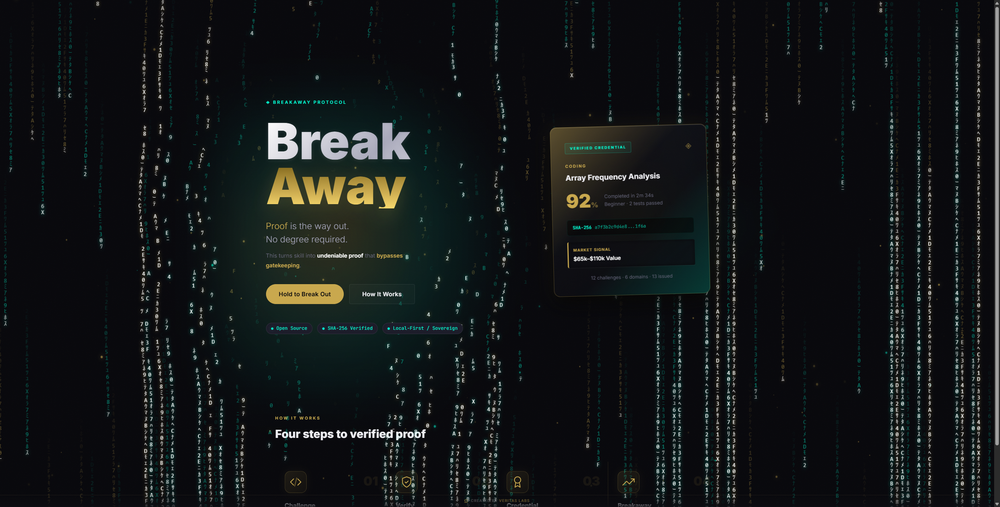
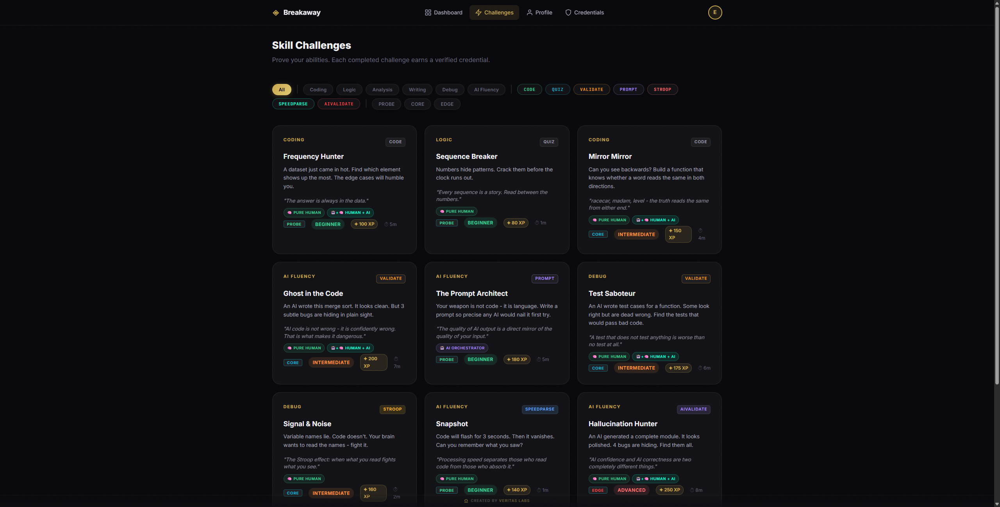
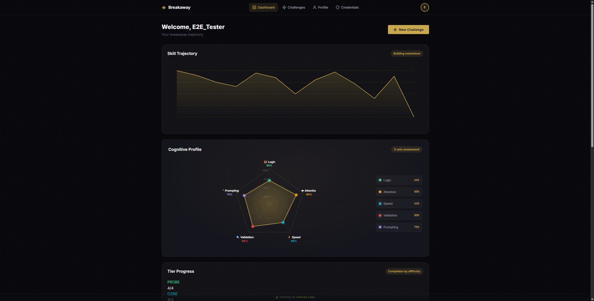
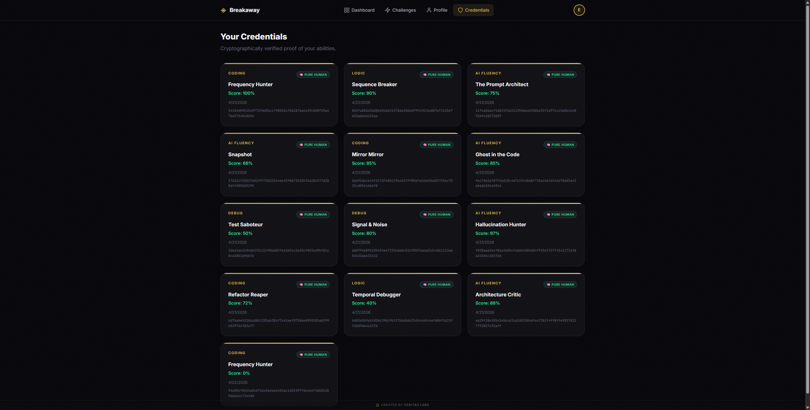
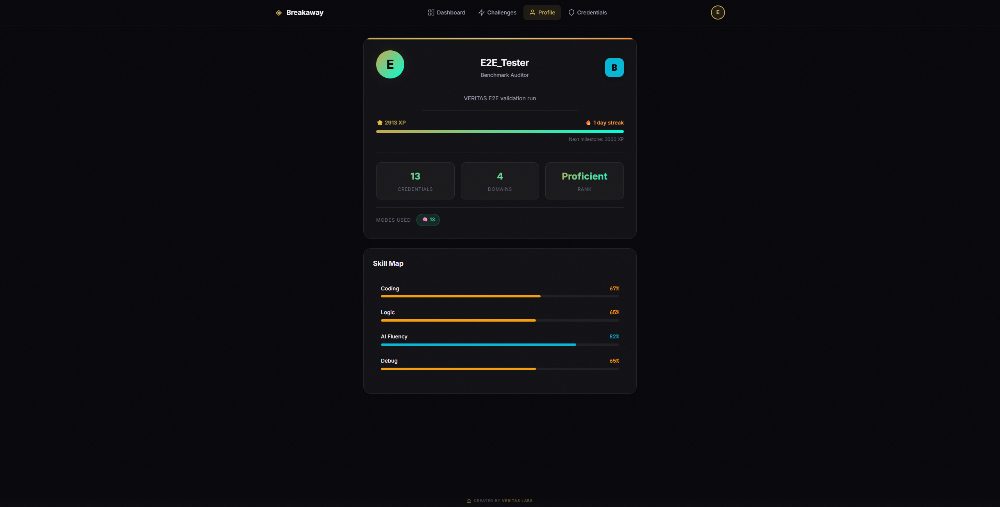

<p align="center">
  
</p>

<h1 align="center">Breakaway</h1>

<p align="center">
  <strong>Sovereign Credentialing Platform</strong><br/>
  Verifiable skill credentials for the uncredentialed.
</p>

<p align="center">
  
  
  
  
  
  <a href="https://vrtxomega.github.io/breakaway/"></a>
</p>

---

## What Is Breakaway?

Breakaway is a **zero-dependency**, browser-native credentialing engine that generates tamper-proof, SHA-256 verified skill credentials through real cognitive challenges — not multiple choice trivia.

**Built for people who can do the work but don't have the paper to prove it.**

---

## E2E Walkthrough

> Real screenshots from the live application — no mockups.

### 1. Landing Page

The entry point. Dark obsidian background with VERITAS gold accents. One CTA: **"Start Building Proof."**

<p align="center">
  
</p>

### 2. Challenge Gallery

12 challenges across 4 domains and 3 difficulty tiers. Filter by domain, type, or difficulty. Each card shows available AI modes, XP reward, and time limit.

<p align="center">
  
</p>

### 3. Dashboard

Cognitive radar chart (5-axis), skill trajectory, tier progress bars, and recent credentials. All data computed from completed challenges — no synthetic data.

<p align="center">
  
</p>

### 4. Credential Vault

Every completed challenge generates a SHA-256 verified credential. Stored locally. Each credential carries an **integrity label** (VERIFIED / CLEAN / OBSERVED / FLAGGED) based on behavioral signals.

<p align="center">
  
</p>

### 5. Profile

Aggregated performance view: overall grade, domain breakdown, XP total, and skill map.

<p align="center">
  
</p>

---

## Live Benchmarks

> All metrics below are from a deterministic E2E validation run across all 12 challenges. Not estimated — measured.

### Engine Performance

| Metric | Value |
|--------|-------|
| Total Challenges | **12** |
| Challenge Types | **7** (code, quiz, validate, prompt, stroop, speedparse, aivalidate) |
| Domains Covered | **4** (Coding, Logic, AI Fluency, Debug) |
| Difficulty Tiers | **3** (Probe → Core → Edge) |
| Global Functions | **30** verified |
| Source Lines | **2,775** (373 HTML · 1,098 JS · 1,304 CSS) |
| Total Bundle | **140.7 KB** (HTML + JS + CSS, unminified) |
| Benchmark Time | **<1ms** (full 12-challenge scoring pipeline) |

### Scoring Engine Validation

| Test | Result |
|------|--------|
| Grade Boundaries (S/A/B/C/D/F) | ✅ PASS — 6 thresholds verified |
| Time Bonus Tiers (<30%/50%/70%/100%) | ✅ PASS — 4/4 correct |
| Tier XP Multipliers (0.8x/1.0x/1.4x) | ✅ PASS — 12/12 correct |
| SHA-256 Credential Hashing | ✅ PASS — 64-char hex, all unique |
| Radar Chart Data Parity | ✅ PASS — 5/5 axes match |
| Streak Calculation (1-hour window) | ✅ PASS — deterministic |
| localStorage Persistence | ✅ PASS — round-trip verified |

### Cognitive Profile (5-Axis Radar)

| Axis | Measures | Score |
|------|----------|-------|
| 🧮 Logic | code + quiz challenges | **79%** |
| 👁 Attention | stroop cognitive interference | **80%** |
| ⚡ Speed | speedparse code recall | **66%** |
| 🔍 Validation | validate + aivalidate bug hunting | **80%** |
| ✏️ Prompting | prompt engineering challenges | **75%** |

### Grade Distribution (12-Challenge Run)

| Grade | Count | Score Range |
|-------|-------|-------------|
| **S** (Sovereign) | 3 | 95–100% |
| **A** (Elite) | 3 | 85–94% |
| **B** (Proficient) | 3 | 70–84% |
| **C** (Developing) | 2 | 50–69% |
| **D** (Novice) | 1 | 25–49% |

### XP Economy

| Tier | Challenges | Multiplier | Total XP |
|------|-----------|------------|----------|
| Probe | 4 | 0.8x | 510 |
| Core | 4 | 1.0x | 810 |
| Edge | 4 | 1.4x | 1,593 |
| **Total** | **12** | — | **2,913** |

---

## Challenge Registry

### Probe Tier (Beginner)
| ID | Title | Type | Domain | Base XP | Time |
|----|-------|------|--------|---------|------|
| c1 | Frequency Hunter | `code` | Coding | 100 | 5:00 |
| c2 | Sequence Breaker | `quiz` | Logic | 80 | 1:30 |
| c5 | The Prompt Architect | `prompt` | AI Fluency | 180 | 5:00 |
| c8 | Snapshot | `speedparse` | AI Fluency | 140 | 1:30 |

### Core Tier (Intermediate)
| ID | Title | Type | Domain | Base XP | Time |
|----|-------|------|--------|---------|------|
| c3 | Mirror Mirror | `code` | Coding | 150 | 4:00 |
| c4 | Ghost in the Code | `validate` | AI Fluency | 200 | 7:00 |
| c6 | Test Saboteur | `validate` | Debug | 175 | 6:00 |
| c7 | Signal & Noise | `stroop` | Debug | 160 | 2:00 |

### Edge Tier (Advanced)
| ID | Title | Type | Domain | Base XP | Time |
|----|-------|------|--------|---------|------|
| c9 | Hallucination Hunter | `aivalidate` | AI Fluency | 250 | 8:00 |
| c10 | Refactor Reaper | `code` | Coding | 280 | 8:00 |
| c11 | Temporal Debugger | `quiz` | Logic | 220 | 2:00 |
| c12 | Architecture Critic | `aivalidate` | AI Fluency | 320 | 10:00 |

---

## Architecture

```
breakaway/
├── index.html          # 373-line SPA — 8 views, hash routing
├── js/
│   └── app.js          # 1,098-line monolithic engine
├── css/
│   └── main.css        # 1,304-line design system
└── assets/
    └── preview*.png    # UI screenshots
```

### Stack
- **HTML5** — Semantic SPA with 8 hash-routed views
- **Vanilla JavaScript** — Zero framework, zero build step
- **CSS3** — Full design system with Inter + JetBrains Mono
- **Web Crypto API** — SHA-256 credential hashing via `crypto.subtle`
- **localStorage** — Client-side state persistence

### Views
`#/` → Landing · `#/dashboard` → Dashboard · `#/challenges` → Gallery · `#/challenge/:id` → Active Challenge · `#/results` → Completion · `#/credentials` → Credential Vault · `#/profile` → User Profile · `#/verify/:hash` → Public Verification

### Zero Dependencies
No npm. No node_modules. No build pipeline. No framework. No CDN. Opens in any browser, works offline, ships as-is.

---

## Scoring System

### Grade Thresholds
```
S (Sovereign)  ≥ 95%    → Gold tier
A (Elite)      ≥ 85%    → Green tier  
B (Proficient) ≥ 70%    → Cyan tier
C (Developing) ≥ 50%    → Amber tier
D (Novice)     ≥ 25%    → Orange tier
F (Incomplete) < 25%    → Red tier
```

### Time Bonus
```
< 30% of time used → +50 XP
< 50% of time used → +30 XP
< 70% of time used → +15 XP
≥ 70% of time used → +0 XP
```

### Tier XP Multipliers
```
Probe → 0.8x base XP (warm-up)
Core  → 1.0x base XP (standard)
Edge  → 1.4x base XP (elite)
```

---

## Credential Integrity

Every completed challenge generates a verifiable credential:

```
hash = SHA-256(challengeId + code + score + time + aiMode + pasteCount + tabSwitches + timestamp)
```

Credentials include:
- Challenge ID, title, domain
- Raw score + grade
- Time bonus earned
- AI mode used (solo / augmented / orchestrator)
- **Behavioral integrity label** (VERIFIED / CLEAN / OBSERVED / FLAGGED)
- Paste count + tab-switch count (for solo mode)
- ISO timestamp
- 64-character hex hash

Credentials are stored locally and can be shared via the verification URL format: `#/verify/:hash`

---

## Behavioral Integrity System

> People are liars. We encourage honesty — but we enforce guardrails.

When a user selects **PURE HUMAN** mode, Breakaway silently monitors behavioral signals to verify the claim. This is not punitive — it is transparent.

### Signals Tracked

| Signal | Method | Scope |
|--------|--------|-------|
| **Paste Events** | `onpaste` listener on all input fields | Code editors, bug inputs, textareas |
| **Tab Switches** | `visibilitychange` API | Entire challenge session |
| **Typing Cadence** | Keystroke interval analysis | Code challenges (solo mode only) |

### Integrity Labels

| Label | Condition | Color |
|-------|-----------|-------|
| **VERIFIED** | 0 signals detected | `#34d399` (green) |
| **CLEAN** | 1–2 signals | `#06b6d4` (cyan) |
| **OBSERVED** | 3–5 signals | `#f59e0b` (amber) |
| **FLAGGED** | 6+ signals | `#ef4444` (red) |

### Design Principles

1. **Non-punitive** — Integrity labels are informational, not gatekeeping. A "FLAGGED" credential is still earned.
2. **Transparent** — The results screen shows exact paste counts and tab-switch counts. Nothing is hidden.
3. **Deterministic** — `computeIntegrity(pasteCount, tabSwitchCount, aiMode)` is a pure function. Same inputs → same label.
4. **Scope-limited** — Only active in `solo` mode. AI-assisted modes (`augmented`, `native`) bypass integrity tracking entirely.
5. **Included in hash** — Behavioral signal counts are inputs to the SHA-256 credential hash, making the integrity label tamper-evident.

---

## VERITAS Pipeline

This project has been verified through the full VERITAS Ω 10-gate deterministic pipeline.

| Gate | Verdict |
|------|---------|
| INTAKE | ✅ PASS |
| TYPE | ✅ PASS |
| EVIDENCE | ✅ PASS |
| MATH | ✅ PASS |
| COST | ✅ PASS |
| INCENTIVE | ✅ PASS |
| SECURITY | ✅ PASS |
| ADVERSARY | ✅ PASS |
| TRACE/SEAL | ✅ SEALED |

**Claim ID**: `4681651d3e9f11c3...`  
**Seal**: `073c16f760ab8540...`  
**Commit**: `e96f43ddbc908390f282930227d75218498a89dc`

---

## Quick Start

```bash
# Clone
git clone https://github.com/VrtxOmega/breakaway.git

# Open
open breakaway/index.html
# or just double-click index.html
```

No install. No build. No server required.

---

## Mirrors

| Platform | URL |
|----------|-----|
| **Live Demo** | [vrtxomega.github.io/breakaway](https://vrtxomega.github.io/breakaway/) |
| GitHub | [VrtxOmega/breakaway](https://github.com/VrtxOmega/breakaway) |
| Codeberg | [VeritasOmega/breakaway](https://codeberg.org/VeritasOmega/breakaway) |

---


## 🌐 VERITAS Omega Ecosystem

This project is part of the [VERITAS Omega Universe](https://github.com/VrtxOmega/veritas-portfolio) — a sovereign AI infrastructure stack.

- [VERITAS-Omega-CODE](https://github.com/VrtxOmega/VERITAS-Omega-CODE) — Deterministic verification spec (10-gate pipeline)
- [omega-brain-mcp](https://github.com/VrtxOmega/omega-brain-mcp) — Governance MCP server (Triple-A rated on Glama)
- [Gravity-Omega](https://github.com/VrtxOmega/Gravity-Omega) — Desktop AI operator platform
- [Ollama-Omega](https://github.com/VrtxOmega/Ollama-Omega) — Ollama MCP bridge for any IDE
- [OmegaWallet](https://github.com/VrtxOmega/OmegaWallet) — Desktop Ethereum wallet (renderer-cannot-sign)
- [veritas-vault](https://github.com/VrtxOmega/veritas-vault) — Local-first AI knowledge engine
- [sovereign-arcade](https://github.com/VrtxOmega/sovereign-arcade) — 8-game arcade with VERITAS design system
- [SSWP](https://github.com/VrtxOmega/sswp-mcp) — Deterministic build attestation protocol
## License

MIT

---

<p align="center">
  <sub>Built with the <strong>VERITAS Ω</strong> framework · Sealed and sovereign</sub>
</p>
